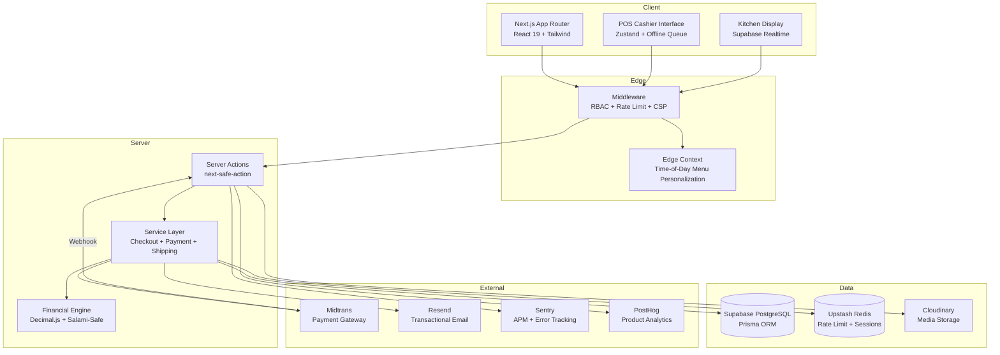

# Pisang Van Java

> **Enterprise F&B Point-of-Sale & E-Commerce Platform**
> Zero-Trust Architecture | Offline-Resilient POS | Real-Time Kitchen Display

Pisang Van Java is a production-grade hybrid web application serving both B2C customers and B2B enterprise operations for a Javanese banana fritter street-food brand. It combines a customer-facing e-commerce storefront with an internal POS system, kitchen display system (KDS), B2B CRM pipeline, and loyalty/gamification engine -- all in a single Next.js monorepo.

---

## Key Highlights

| Feature | Implementation |
|---|---|
| **Financial Precision Engine** | Decimal.js-based calculator with Salami-Slicing attack prevention, server-only execution, and DB-sourced pricing |
| **Zero-Trust Security** | 6-role RBAC, Argon2id hashing, TOTP 2FA, HMAC webhook verification, Redis session revocation, fail-closed middleware |
| **Real-Time Kitchen Display** | Supabase Realtime subscriptions with polling fallback, Wake Lock API, audio notifications |
| **Offline-Resilient POS** | Zustand-powered offline queue with sync-on-reconnect, QRIS and cash payment flows |
| **Payment Gateway** | Midtrans Snap Token integration (QRIS, VA, bank transfer) with webhook reconciliation and idempotency keys |
| **Edge Context Personalization** | Middleware injects time-of-day menu context (early morning, lunch, late night) via cookies at the Edge |
| **CSP & Rate Limiting** | Per-IP rate limiting via Upstash Redis, Content Security Policy with nonce-based script allowlisting |

---

## Tech Stack

| Domain | Technology |
|---|---|
| **Framework** | Next.js 16 (App Router, Turbopack) |
| **Language** | Strict TypeScript |
| **Database** | Supabase (PostgreSQL, Realtime, pgvector) |
| **ORM** | Prisma |
| **Authentication** | NextAuth.js v5 (Credentials + Google OAuth), Argon2id, TOTP 2FA |
| **Validation** | Zod, `@t3-oss/env-nextjs` |
| **Styling** | Tailwind CSS, shadcn/ui, next-themes |
| **State Management** | Zustand (Global), nuqs (URL State) |
| **Data Fetching** | Server Actions + next-safe-action, TanStack Query v5 |
| **Payments** | Midtrans (Snap Token, QRIS, Webhook) |
| **Email** | Resend + React Email |
| **Media** | Cloudinary + Supabase Storage |
| **Observability** | Sentry (APM), PostHog (Analytics) |
| **Security** | Upstash Redis (Rate Limiting, Session Store), CSP Headers, HMAC Verification |
| **Linting** | Biome |
| **Testing** | Vitest, Playwright |
| **Package Manager** | pnpm (strictly enforced) |
| **Infrastructure** | Terraform (Cloudflare WAF + DNS), Docker, Vercel Edge |

---

## Architecture



### Design Principles

- **Feature-Sliced Design (VSA):** Code is organized by domain (`src/features/auth`, `src/features/pos`, `src/features/cart`) with isolation between features
- **Zero-Trust Security:** All server boundaries validate authentication, authorization, and input. No implicit trust between layers
- **Fail-Closed:** If Redis is unavailable for session verification, access is denied rather than allowed
- **Server-Only Financial Logic:** The money calculation engine (`src/lib/financial/money.ts`) uses `server-only` guard to prevent client bundle inclusion
- **Optimistic Concurrency Control:** Menu variants use a `version` field for OCC; orders use Prisma `$transaction` for ACID guarantees

---

## Project Structure

```
pisang-van-java/
├── app/                    # Next.js App Router
│   ├── (admin)/            # Admin/Staff routes (dashboard, POS, kitchen, B2B)
│   ├── (user)/             # Customer routes (menu, checkout, profile, reviews)
│   └── api/                # API routes (webhooks, admin, user, pos)
├── src/
│   ├── auth.ts             # NextAuth.js v5 configuration
│   ├── env.ts              # t3-env zero-trust environment validation
│   ├── features/           # Feature-based business logic
│   │   ├── auth/           # Authentication (actions, schemas)
│   │   ├── cart/           # Cart (store, drawer, sync provider, merge conflict)
│   │   ├── checkout/       # Checkout (actions, schemas, money engine tests)
│   │   ├── menu/           # Menu catalog (admin dashboard, cards)
│   │   ├── payment/        # Payment (status mapper, service, email templates)
│   │   ├── pos/            # Point of Sale (store, QRIS, cash, offline sync)
│   │   ├── reviews/        # Reviews system
│   │   ├── settings/       # Admin settings + map
│   │   └── admin/          # Admin actions (ban user)
│   ├── lib/
│   │   ├── financial/      # Decimal.js money engine (Salami-Safe)
│   │   ├── store/          # Zustand stores
│   │   └── validations/    # Zod schemas
│   ├── services/           # Service layer (checkout, shipping)
│   ├── repositories/       # Repository pattern (checkout)
│   ├── emails/             # React Email templates
│   ├── providers/          # Context providers (PostHog, TanStack Query)
│   └── hooks/              # Custom hooks (admin realtime)
├── components/             # Shared UI components
│   ├── admin/              # Admin shell, sidebar, modals
│   ├── user/               # Navbar, hero, menu grid, footer
│   └── ui/                 # shadcn/ui primitives
├── context/                # React contexts (cart, language, settings, theme)
├── prisma/                 # Schema + seeders
├── infra/                  # Terraform (Cloudflare WAF + DNS)
├── docs/                   # Documentation (compliance, CRO audit)
├── public/                 # Static assets + PWA manifest
└── scripts/                # Operational scripts (backup, restore, optimize)
```

---

## Quick Start

### Prerequisites

- **Node.js** >= 20
- **pnpm** >= 11 (strictly enforced -- npm/yarn will be rejected)
- **Supabase** account (PostgreSQL database)
- **Upstash** account (Redis for rate limiting + sessions)

### 1. Clone & Install

```bash
git clone <your-repo-url>
cd pisang-van-java
pnpm install
```

### 2. Configure Environment

```bash
cp .env.example .env
```

Fill in all required variables in `.env`. The build will fail-safe if critical variables are missing (enforced by `@t3-oss/env-nextjs` at build and runtime).

### 3. Setup Database

```bash
pnpm run db:push    # Push Prisma schema to PostgreSQL
pnpm run db:seed    # Seed demo data
```

### 4. Run Development Server

```bash
pnpm run dev
```

Open [http://localhost:3000](http://localhost:3000)

---

## Commands

```bash
# Development
pnpm run dev              # Start dev server with Turbopack
pnpm run build            # Production build (prisma generate + next build)
pnpm run start            # Start production server

# Database
pnpm run db:push          # Sync schema to database
pnpm run db:studio        # Open Prisma Studio GUI
pnpm run db:seed          # Seed demo data

# Code Quality
pnpm run check            # Biome format + lint (write mode)
pnpm run lint:biome       # Biome lint only
pnpm run format           # Biome format only
pnpm run secretlint       # Scan for leaked secrets

# Testing
pnpm run test             # Unit tests (Vitest)
pnpm run test:watch       # Unit tests in watch mode
pnpm run test:e2e         # End-to-end tests (Playwright)

# Infrastructure
pnpm run sentry:sourcemaps   # Upload source maps to Sentry
pnpm run audit:fix           # Fix vulnerable dependencies
```

---

## RBAC & Security Model

The application enforces a 6-role hierarchy through Edge middleware:

| Role | Access Scope |
|---|---|
| `SUPER_ADMIN` | All routes |
| `ADMIN` | Dashboard, menu management, users, vouchers, CRM, settings, reports |
| `KITCHEN` | Kitchen display, order status updates |
| `CASHIER` | POS cashier interface, order management |
| `CUSTOMER` | Menu, checkout, profile, order tracking, reviews |
| `RESELLER` | Customer routes + wholesale pricing |

**Security measures enforced at the Edge:**
- Per-IP rate limiting (Upstash Redis) on all matched routes
- Banned user detection with Redis cache + DB fallback
- Hybrid session validation (Prisma session + Redis active session check)
- CSP headers with nonce-based script allowlisting
- Fail-closed: if Redis is unavailable, access is denied

---

## Demo Accounts

| Role | URL | Email | Password |
|---|---|---|---|
| Super Admin | `/login` | `admin` | `admin123` |
| Kitchen Staff | `/login` | `kitchen` | `kitchen123` |
| Cashier | `/login` | `cashier` | `cashier123` |

Change these credentials immediately in production.

---

## Database Schema

The Prisma schema defines 18 models covering the full business domain:

- **User & Auth:** User, Account, Session, ResetToken, AuthLog (with TOTP 2FA support)
- **Product:** MenuVariant (with OCC versioning, soft delete, tags), Topping, StoreBranch
- **Orders:** Order, OrderItem, Payment (with idempotency keys, Midtrans integration)
- **CRM:** B2BDeal (pipeline stages), ContactLead, Complaint
- **Loyalty:** KoinPisangLog (gamification points), Voucher
- **Content:** Banner, Review, Favorite, SiteSetting
- **E-Commerce:** UserCart, Address

---

## Notable Code References

| File | Description |
|---|---|
| `src/lib/financial/money.ts` | Decimal.js financial engine with Salami-Slicing prevention |
| `middleware.ts` | RBAC + rate limiting + CSP + Edge context injection |
| `src/auth.ts` | NextAuth.js v5 with Argon2id, Google OAuth, Supabase JWT bridge, TOTP 2FA |
| `src/services/checkout.service.ts` | Core checkout orchestration (2FA, voucher, order creation, Midtrans, WhatsApp) |
| `src/features/payment/payment-status.mapper.ts` | Pure Midtrans-to-internal payment status mapping |
| `app/(admin)/kitchen/KitchenClient.tsx` | Real-time KDS with Supabase Realtime, polling fallback, Wake Lock |
| `app/(admin)/kasir/PosClient.tsx` | Offline-resilient POS with Zustand store and sync queue |

---

## Testing

The project uses Vitest for unit/integration tests and Playwright for E2E:

```
__tests__/                          # Root-level test suite
src/features/checkout/__tests__/    # Money engine + schema validation
src/features/payment/__tests__/     # Payment service
src/services/__tests__/             # Checkout + shipping services
app/api/orders/track/route.test.ts  # API route integration test
app/api/orders/[id]/invoice/        # Invoice route test
src/__tests__/                      # Error boundaries + compliance
```

---

## CI/CD

- **GitHub Actions:** CI pipeline (`.github/workflows/ci.yml`), CodeQL analysis, security scanning
- **Husky + lint-staged:** Pre-commit hooks running Biome + secretlint
- **Sentry:** Source map upload for production error tracking
- **Vercel:** Edge deployment with caching

---

## Infrastructure

- **Terraform:** Cloudflare WAF rules, DNS configuration (`infra/cloudflare/`)
- **Docker:** `Dockerfile` + `docker-compose.yml` for containerized deployment
- **PWA:** Service worker + manifest for installable web app

---

## Documentation

- [`ARCHITECTURE.md`](ARCHITECTURE.md) -- Technical architecture standards
- [`PRD.md`](PRD.md) -- Product requirements document
- [`DESIGN.md`](DESIGN.md) -- Starbucks-inspired design system reference
- [`SECURITY.md`](../SECURITY.md) -- Security policy
- [`docs/`](docs/) -- Compliance, CRO audit, operational docs

---

## License

Academic / Enterprise Prototype -- Informatics Student SDLC Project 2024-2026.

Brand: **Pisang Van Java**
